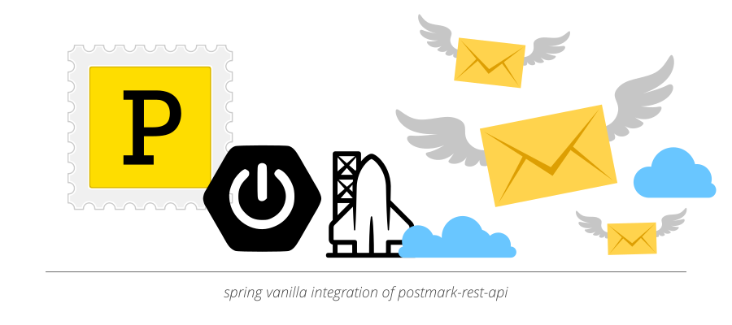

# postmark-spring




[](https://mvnrepository.com/artifact/io.rocketbase.mail/postmark-spring)


Vanilla spring version of handling postmark's rest-api.

Features:
- [X] Deliver Message
- [X] Deliver Batch Messages
- [X] MessageResponse
- [X] WebhookMessages (to receive email stats via webhook)
- [ ] Stats / Bounce / Templates
- [ ] Server / OutboundMessages / InboundMessages

## configuration

|                      | default | explanation                   |
| -------------------- | ------- | ----------------------------- |
| postmark.token   | *required*   | server-api-token of postmark   |
| postmark.api.url  | https://api.postmarkapp.com/      | normally no change is required   |
| postmark.api.header | X-Postmark-Server-Token      | normally no change is required       |


## usage

````java
@Resource
private PostmarkClient postmarkClient;

Message msg = new Message("from@rocketbase.io", "to@rocketbase.io", "postmark-spring test", "<h1>hello</h1><p>Great it works</p>", "hello\nGreat it works");
MessageResponse rsp = postmarkClient.deliverMessage(msg);
````
